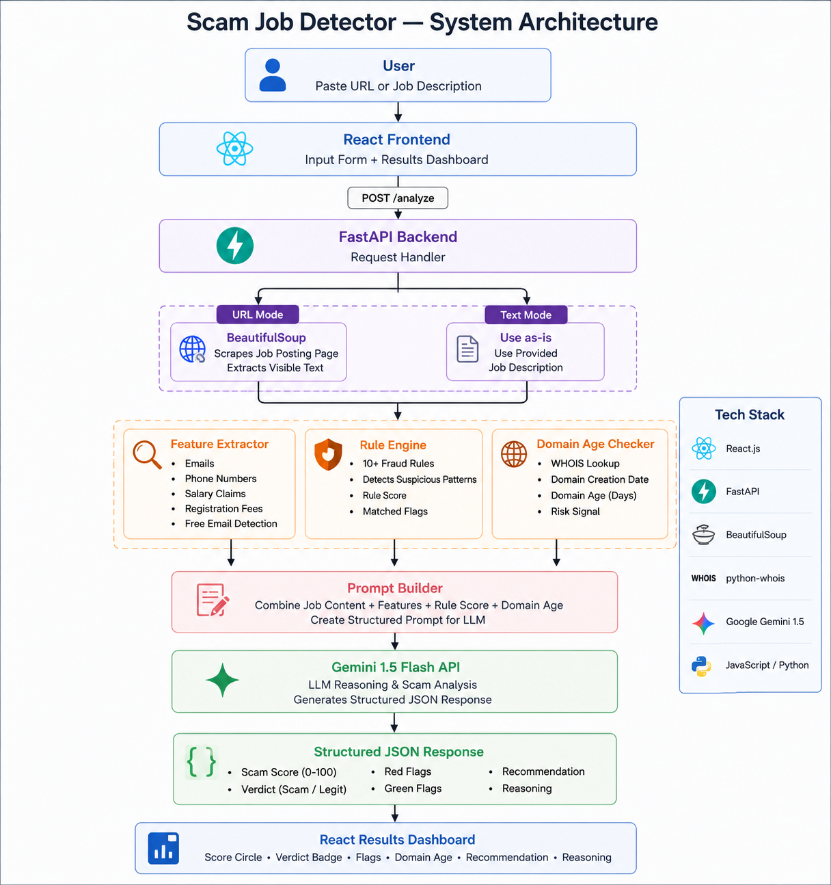

# System Design — Scam Job Detector

## System Architecture

<p align="center">
  
</p>

### Architecture Flow

```text

User Input (URL or Text)
        │
        ▼
React Frontend
        │
        ▼ POST /analyze
FastAPI Backend
        │
 ┌──────┴──────┐
 │             │
 ▼             ▼
URL Mode    Text Mode
 │             │
BeautifulSoup  Use as-is
scrapes page
 │
 └──────┬──────┘
        ▼
Feature Extractor
(emails, salary, fees)
        ▼
Rule-Based Checker
(10+ fraud patterns)
        ▼
WHOIS Domain Age Check
        ▼
Gemini 1.5 Flash API
        ▼
Structured JSON Response
        ▼
React Result Dashboard
```

---

## Problem Statement

Job scams are a widespread problem targeting Indian students and early-career developers. Postings promise high salaries, require no experience, and often demand upfront registration fees. Victims lose money and time with no recourse.

Existing tools like Google and Naukri do not flag suspicious postings. No free, simple verification tool existed for this specific problem.

---

## Data Flow

1. User pastes a job URL or description into the React frontend.
2. Frontend sends a POST request to `/analyze` with `{url, text}`.
3. If a URL is provided, BeautifulSoup fetches and extracts visible text (capped at 3000 characters to stay within token limits).
4. `python-whois` retrieves the domain creation date and calculates domain age.
5. The feature extraction module scans for:

   * Email addresses
   * Phone numbers
   * Salary mentions
   * Registration fee indicators
6. The rule engine checks 10+ known fraud patterns and records matched flags.
7. Extracted features, rule score, domain age, and job content are combined into a structured prompt.
8. Gemini 1.5 Flash performs contextual scam analysis.
9. Gemini returns a structured JSON response containing:

   * Scam score
   * Verdict
   * Red flags
   * Green flags
   * Recommendation
   * Reasoning
10. FastAPI returns the response to the React frontend for visualization.

---

## Prompt Design


While building the project, I noticed that giving Gemini only the raw job description sometimes produced inconsistent results. For example, obvious indicators such as registration fees or Gmail recruiter emails were not always given enough importance.

To improve reliability, I started extracting important signals from the job posting before sending it to the LLM. These included email addresses, salary claims, registration fee mentions, and domain age information. These extracted features were included in the prompt along with the original job content.

I also forced Gemini to return a structured JSON response containing a scam score, verdict, red flags, green flags, recommendation, and reasoning. This made the response easier to parse and display in the frontend.

The final prompt combines three types of information:

- Original job content
- Extracted features
- Rule-based fraud indicators

This helped the model make more consistent decisions while still allowing it to reason about context.

### Specificity

Generic scam detection prompts often produce vague results. The prompt explicitly includes common Indian job scam patterns such as:

* Registration fees in rupees
* Gmail recruiter emails
* Unrealistic fresher salaries
* Urgency tactics
* Work-from-home scams

This improves relevance and consistency.

### Structured Output

The prompt requests a strict JSON response format. This enables reliable parsing without depending on fragile text extraction techniques.

### Context Injection

The prompt includes:

* Job content
* Domain age
* Extracted features
* Rule-based signals

This allows Gemini to reason using both contextual information and structured evidence.

---

## Trade-offs and Design Decisions

### Scraping vs Manual Input

Initially, I planned to analyze jobs directly from URLs. During testing, I found that many platforms such as LinkedIn and Naukri restrict scraping or dynamically load content, making extraction unreliable.

To solve this, I added a text input mode where users can directly paste the job description. This ensures the tool remains usable even when scraping fails.

### Input Length Limitation

Job descriptions can be very long, which increases API cost and response time. Since scam indicators usually appear within the main content, I limited the extracted text length before sending it to Gemini.

This keeps response times low while still preserving the information needed for analysis.

### Rule-Based + LLM Hybrid Architecture

My first version relied entirely on Gemini for scam detection. While it worked reasonably well, some obvious scam indicators were occasionally missed.

I introduced a lightweight rule engine to detect patterns such as:

- Registration fees
- Generic Gmail recruiter emails
- Unrealistic salary claims
- No-experience-required offers

The rule engine provides deterministic signals, while Gemini handles contextual reasoning. This hybrid approach produced more reliable results than either method alone.

### JSON Parsing Reliability

Gemini occasionally wraps responses inside markdown code blocks.

To make the system more reliable, markdown fences are removed before parsing and exception handling is used to prevent application crashes.

### Domain Age Signal

I experimented with using domain age as an additional trust signal. New domains are often associated with scams, but legitimate startups can also have recently registered domains.

Because of this, domain age is treated only as supporting evidence rather than a deciding factor.

## Limitations

* Scraping may fail on heavily protected websites.
* Gemini free-tier usage is subject to quota limits.
* Domain age alone is not sufficient to determine legitimacy.
* The application does not maintain historical scam records.
* Company names are not verified against official registries.

---

## Future Scope

* MCA India company registry verification
* Historical scam pattern database
* Browser extension for one-click analysis
* Crowdsourced scam reporting system
* Company domain validation
* Multi-model verification pipeline

---

## Conclusion

The Scam Job Detector was built to address a problem that many students and fresh graduates face when searching for jobs online. Instead of relying entirely on AI or entirely on predefined rules, the system combines feature extraction, rule-based detection, and Gemini-powered reasoning.

This approach provides both explainability and contextual understanding. The project successfully identifies common job scam patterns while remaining simple enough to run in real time through a web interface.During testing, the system was able to correctly identify common advance-fee scams while also recognizing legitimate internship postings from established companies.

While there is room for improvement, such as company verification and historical scam databases, the current prototype demonstrates how LLMs can be combined with traditional software techniques to solve a practical real-world problem.
